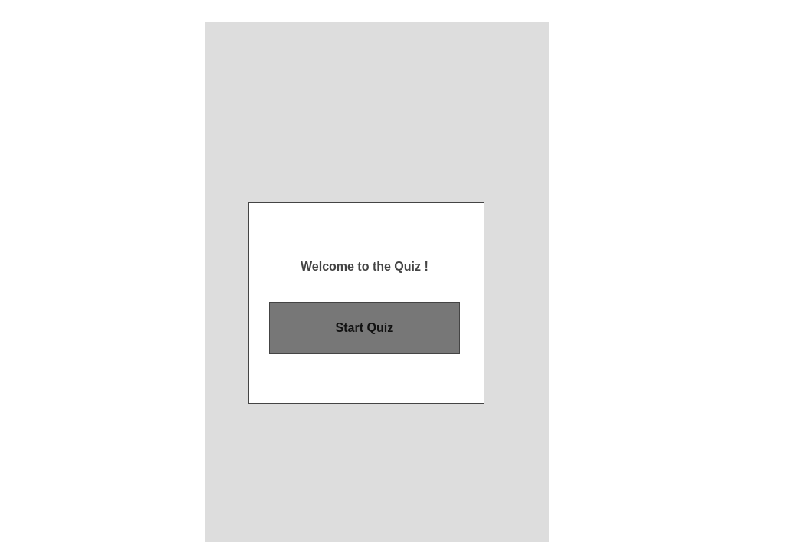
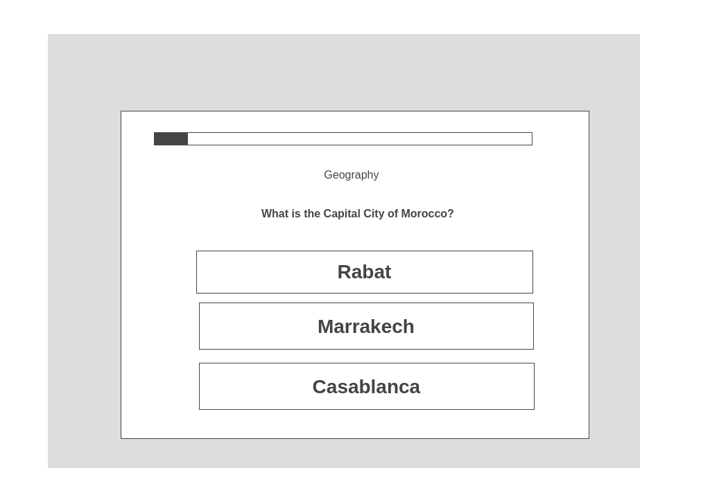
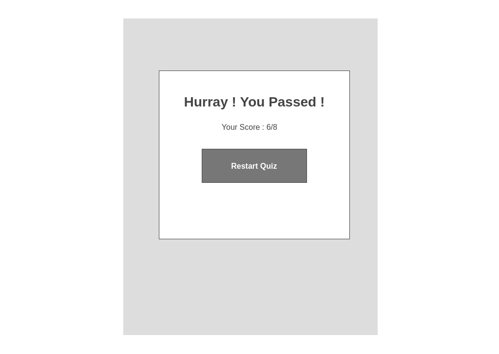
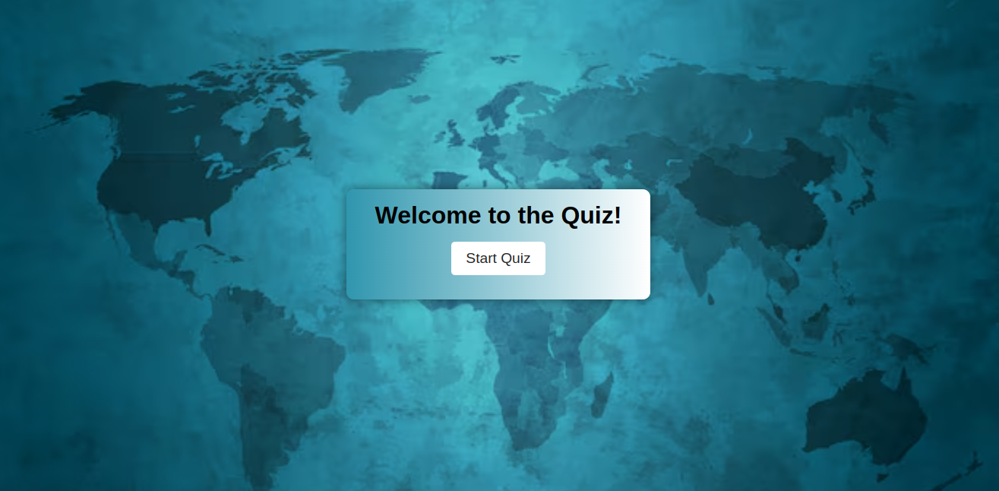
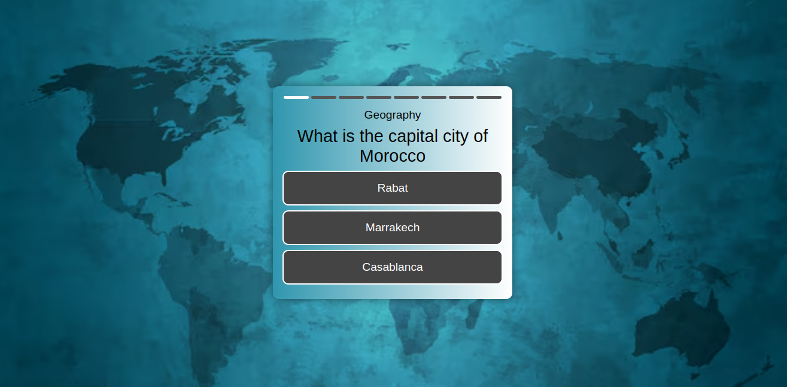
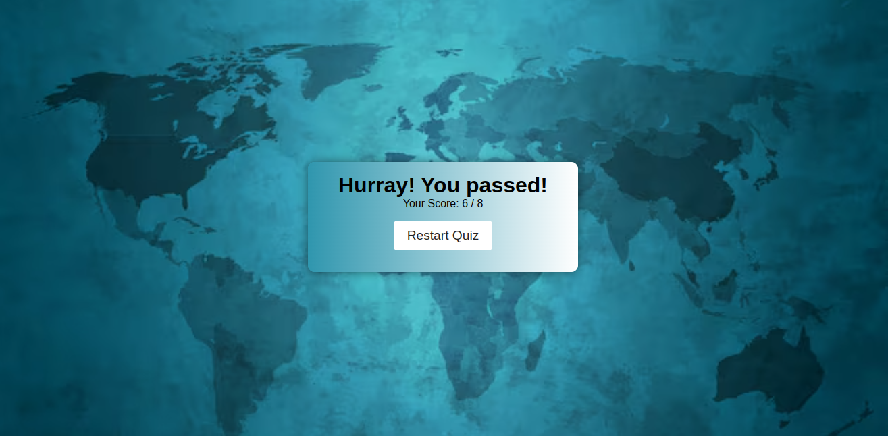

# Quiz Game 🌍

Welcome to the **Quiz Game**! This project is a geography-based quiz game where players can test their knowledge of the world. Below is the detailed documentation for the project.

---

## Visit the Deployed Site

[Click here to view the Quiz Game](https://zoyarasheed.github.io/Quiz-App/)

---

## Contents

- [User Experience](#user-experience)
  - [User Stories](#user-stories)
- [Design](#design)
  - [Colour Scheme](#colour-scheme)
  - [Typography](#typography)
  - [Imagery](#imagery)
  - [Wireframes](#wireframes)
  - [Features](#features)
    - [The Home Page](#the-home-page)
    - [The Game Page](#the-game-page)
    - [The End Score Page](#the-end-score-page)
    - [Future Implementations](#future-implementations)
  - [Accessibility](#accessibility)
- [Technologies Used](#technologies-used)
  - [Languages Used](#languages-used)
  - [Frameworks, Libraries & Programs Used](#frameworks-libraries--programs-used)
- [Deployment & Local Development](#deployment--local-development)
  - [Deployment](#deployment)
  - [Local Development](#local-development)
    - [How to Fork](#how-to-fork)
    - [How to Clone](#how-to-clone)
- [Testing](#testing)
  - [Solved Bugs](#solved-bugs)
  - [Known Bugs](#known-bugs)
- [Credits](#credits)
  - [Code Used](#code-used)
  - [Content](#content)
  - [Media](#media)
  - [Acknowledgments](#acknowledgments)

---

## User Experience

### User Stories

- As a player, I want to test my knowledge of world geography in an interactive and fun way.
- As a new user, I want clear instructions to play the quiz game.
- As a returning user, I want to see my score to track progress.
- As an accessibility-conscious user, I want the game to be easy to navigate with assistive technologies.

---

## Design

### Colour Scheme

- The app uses a color scheme inspired by geography themes, including:
  - **Background Color**: A world map image for relevance to geography.
  - **Primary Colors**: Shades of blue for buttons and navigation.
  - **Accent Colors**: Green and white for text and highlights.

---

### Typography

- Fonts Used:
  - **Heading Font**: [Roboto](https://fonts.google.com/specimen/Roboto), a clean and modern sans-serif font.
  - **Body Font**: [Open Sans](https://fonts.google.com/specimen/Open+Sans) for readability.
- All fonts were sourced from [Google Fonts](https://fonts.google.com/).

```css
/* Example typography from app.css */
body {
  font-family: 'Open Sans', sans-serif;
}
h1, h2, h3 {
  font-family: 'Roboto', sans-serif;
}

```
### Imagery

- The app's background image features a world map to complement the quiz's theme.


---

### Wireframes

- **Home Page Wireframe**  
  

- **Game Page Wireframe**  
  

- **End Score Wireframe**  
  


  ### Features

#### The Home Page

- A welcoming screen with:
  - A Quiz Start button to begin the quiz.




#### The Game Page

- Displays a random geography-related question.
- Multiple-choice answers are shown as buttons.
- Tracks and displays the current question number and score.



#### The End Score Page

- Displays the player's total score.
- Includes a "Restart Quiz" button to restart the quiz.




### Future Implementations

- Add a timer to each question to increase challenge.
- Include more question categories, such as history or science.
- Add a leaderboard to display top players.

### Accessibility

- The app uses semantic HTML to ensure screen readers can navigate effectively.
- Button labels are descriptive for users relying on assistive technologies.
- Text has a high contrast ratio against the background for readability.

## Technologies Used

### Languages Used

- [HTML](https://developer.mozilla.org/en-US/docs/Web/HTML)
- [CSS](https://developer.mozilla.org/en-US/docs/Web/CSS)
- [JavaScript](https://developer.mozilla.org/en-US/docs/Web/JavaScript)

### Frameworks, Libraries & Programs Used

- [Google Fonts](https://fonts.google.com/) for typography.
- [Font Awesome](https://fontawesome.com/) for icons.
- [Git](https://git-scm.com/) for version control.
- [GitHub Pages](https://pages.github.com/) for deployment.
- [Wireframe.cc](https://wireframe.cc/) for wireframes.


## Deployment & Local Development

### Deployment

The site is deployed using [GitHub Pages](https://pages.github.com/). Visit the live project [here](https://zoyarasheed.github.io/Quiz-App/).

### Local Development

#### How to Fork

- Navigate to the [GitHub repository](https://github.com/ZoyaRasheed/Quiz-App).
- Click the **Fork** button in the top right corner.

#### How to Clone

- Copy the repository URL: `git@github.com:ZoyaRasheed/Quiz-App.git`.
- Open your terminal and run:

```bash
git clone git@github.com:ZoyaRasheed/Quiz-App.git

```

## Testing

### Solved Bugs

- Fixed an issue where incorrect answers would not update the score.
- Adjusted layout to ensure responsiveness on smaller devices.

### Known Bugs

- Occasionally, the "Play Again" button does not reset the score and does not exist for now. This will be fixed in future updates.

---

## Credits

### Code Used

- Used responsive button styles from [CSS-Tricks](https://css-tricks.com/).

### Content

- All quiz questions were sourced from [Open Trivia Database](https://opentdb.com/).

### Media

- Background image sourced from [Unsplash](https://unsplash.com/).

### Acknowledgments

- Special thanks to my mentor for guidance on this project.


